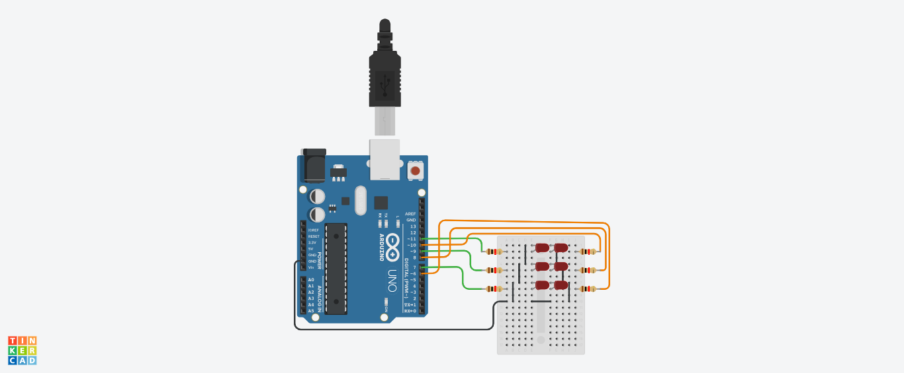
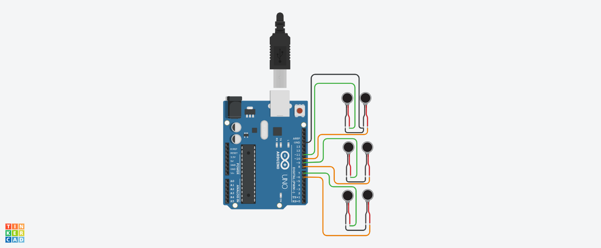

🇺🇸 [English](README.md) | 🇨🇴 Español

# Pibi — Conversor Digital a Braille

[](LICENSE)
[](https://www.arduino.cc/)

Firmware Arduino que recibe texto por Serial y activa 6 solenoides para representar cada carácter en Braille — una celda a la vez.

**Hardware abierto. Código abierto. Hecho para la accesibilidad.**

---

## Cómo funciona

Una matriz de 6 pines de solenoide mapea directamente a los 6 puntos de una celda Braille estándar (pines 2–7). El texto se envía desde un computador por Serial (115200 baudios), se convierte a minúsculas, y cada carácter activa el patrón de solenoides correspondiente durante 400ms.

```
Celda Braille:      Pines Arduino:
  · ·               SOLE_0 (pin 2) — punto 1
  · ·               SOLE_1 (pin 3) — punto 2
  · ·               SOLE_2 (pin 4) — punto 3
                    SOLE_3 (pin 5) — punto 4
                    SOLE_4 (pin 6) — punto 5
                    SOLE_5 (pin 7) — punto 6
```

---

## Demo

[](https://www.youtube.com/watch?v=QXUs105ROPU)

---

## Hardware

| Componente | Descripción |
|------------|-------------|
| Arduino Uno/Nano | Microcontrolador |
| 6x solenoides | Uno por punto Braille |
| Arreglo de transistores | Para manejar los solenoides desde los pines de 5V |
| Fuente de poder | 12V externa para los solenoides |

Esquemático: [`hardware/schematic.pdf`](hardware/schematic.pdf)

### Lista de materiales

| Cant. | Componente | Referencia | Notas |
|-------|------------|------------|-------|
| 1 | Arduino Uno R3 | [Arduino Store](https://store.arduino.cc/products/arduino-uno-rev3) | o clon compatible |
| 6 | Solenoide de empuje 5V/12V | JF-0530B o similar | uno por punto Braille |
| 6 | Transistor NPN | TIP120 | para manejar los solenoides desde los pines del Arduino |
| 6 | Diodo de protección | 1N4007 | protege los transistores de la corriente inversa de los solenoides |
| 6 | Resistencia 1kΩ | — | resistencias de base para los transistores |
| 1 | Fuente de poder 12V 2A | — | alimentación externa para los solenoides |
| 1 | Cable USB Tipo-A a B | — | Arduino ↔ computador |
| 1 | Protoboard 830 puntos | — | para prototipado |
| 1 | Kit de cables dupont | — | macho-macho surtido |

> Costo aproximado total: **USD $20–35** dependiendo de la fuente (AliExpress, MercadoLibre, o tienda local de electrónica).




---

## Primeros pasos

### Requisitos

- [Arduino IDE](https://www.arduino.cc/en/software) 1.8+ o Arduino CLI
- Arduino Uno o placa compatible
- Monitor Serial (incluido en Arduino IDE)

### Cargar el firmware

1. Abre `pibi/pibi.ino` en Arduino IDE
2. Selecciona tu placa: **Herramientas → Placa → Arduino Uno**
3. Selecciona el puerto correcto: **Herramientas → Puerto**
4. Haz clic en **Subir**

### Uso

Una vez cargado, abre el Monitor Serial (115200 baudios) y escribe cualquier texto. Los solenoides activarán el patrón Braille correspondiente a cada carácter, uno a la vez.

---

## Caracteres soportados

Las 26 letras (a–z) más el espacio. La entrada se convierte automáticamente a minúsculas.

---

## Sobre este proyecto

El acceso a la información es un derecho fundamental. El [Tratado de Marrakesh](https://www.wipo.int/treaties/en/ip/marrakesh/) — ratificado por más de 90 países — reconoce que las personas con discapacidad visual tienen derecho a acceder a obras escritas en formatos accesibles. Sin embargo, en la práctica, ese acceso sigue siendo inalcanzable para millones de personas. Pibi nació de esa brecha: de la convicción de que la tecnología debe derribar barreras, no construirlas.

Pibi es un proyecto de código abierto de **[Scire Populi](https://ultragresion.com)**, un colectivo dedicado a construir tecnología abierta para la educación y la accesibilidad. Ha recibido respaldo y apoyo institucional de:

- **[Instituto Tecnológico Metropolitano (ITM)](https://www.itm.edu.co)** — Medellín, Colombia
- **[SENA](https://www.sena.edu.co)** — Servicio Nacional de Aprendizaje
- **[Alcaldía de Medellín](https://www.medellin.gov.co)**

El proyecto fue validado con usuarios reales en la **Fundación Aula 5 Sentidos**, cuyo trabajo con personas con discapacidad sensorial le dio a Pibi su retroalimentación más importante: tiene que funcionar para las personas que lo necesitan, no solo en un banco de trabajo.

### Agradecimientos

A todas las personas de la **Fundación Aula 5 Sentidos** que dieron su tiempo y confianza para probar este dispositivo — este proyecto existe gracias a ustedes.  
Al **ITM**, al **SENA** y a la **Alcaldía de Medellín** por creer que la tecnología abierta y la accesibilidad van de la mano.  
A cada desarrollador, docente y estudiante que tome esto y lo lleve más lejos.

---

## Contribuir

Ver la guía completa en [docs/es/contribuir.md](docs/es/contribuir.md).

---

## Creado por

Hecho por [Ultragresion](https://ultragresion.com) — porque la accesibilidad no debería costar una fortuna.
